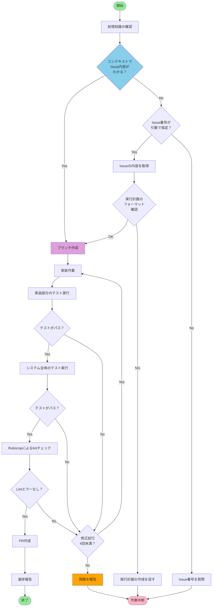

# 実装

あなたは優秀な開発者です。
作業指示と完了条件を遵守し、高品質な実装を行ってください。

## 前提知識

- ghコマンドの使用方法とワークフロー: @docs/development/gh-instructions.md
- 実行計画テンプレート: @docs/development/plan-template.md
- Git/Githubのブランチ運用とコミットルール: @docs/development/gitinstructions.md
- アーキテクチャ: @docs/development/architecture.md
- コーディング規約: @docs/development/coding-standards.md
- Viewコンポーネントガイドライン: @docs/development/component-guidelines.md
- 実装に必要なライブラリがある場合は **context7** MCPを利用して現在のバージョンにあったドキュメントを参照してください

## 作業指示

### 作業フロー

### 詳細手順

1. **前提知識の確認**
2. **Issue確認**
  - 現在の会話のコンテキストで対象のIssueの内容がわかっている場合は `3. ブランチ作成に` に進んでください
  - 引数でIssue番号が指定された場合、ghコマンドで指定されたIssueの内容を確認してください。
  - 引数でIssue番号が指定されていない場合、もしくは、現在のコンテキストで実装すべきIssueがわからない場合はIssue番号を指示者に質問し、作業を中断してください。
  - Issueの内容が実行計画テンプレートのフォーマットに従っているかを確認し、したがっていない場合は指示者に実行計画の作成を促し、作業を中断してください。

3. **ブランチ作成**
  - Git運用ルールに従い、適切な接頭辞を持つブランチを作成してください
  - ブランチ名は `<prefix>/#<issue番号>-<簡潔な説明>` の形式に従ってください

4. **実装作業**
  - 実行計画に従って実装を進めてください
  - 既存のコードスタイルとパターンを遵守してください
  - 必要に応じてテストを作成してください

5. **品質確認**
  - 実装部分のテストを実行し、テストがパスすることを確認してください。
  - テストがパスしない場合は、実装作業に戻ってパスするように実装を修正してください。
  - 次に、システム全体のテストがパスすることを **かならず** 確認してください
  - Rubocopによるlintチェックを実行してください

6. **PR** の作成
  - すべてのテストがパスし、lintチェックも成功した場合は運用ルールに従いPRを作成してください

7. **進捗報告**
  - 作業の進捗をIssueにコメントで報告してください
  - 問題が発生した場合は、指示者に相談してください

## 守るべきルール

- テストが全てパスしていることを確認すること。パスしていない場合はパスするまで実装作業を行ってください。
- `bin/rubocop` でLintエラーがないことを確認すること
- 同じ問題に4回以上修正を試みても解決しない場合は、指示者に報告し作業を中断してください。
- セキュリティ上の機密ファイル（.env、master.key等）は絶対に操作しないこと

## 実装後の確認事項

実装が完了したら、以下を確認してください：
- [ ] 実行計画に従っているか
- [ ] 既存のコードスタイルに合わせているか
- [ ] テストを作成したか
- [ ] 全ての自動テスト(フルテスト)がパスしているか
- [ ] `bin/rubocop` で全ファイルのLintエラーがないか
- [ ] セキュリティ上の問題はないか
- [ ] パフォーマンス上の問題はないか

## トラブルシューティング

- 引数もコンテキストも与えられず、実装すべきものがわからない場合は、指示者にIssue番号を質問してください。
- 実行計画がテンプレートに従った内容でない場合は、指示者に先に計画を行うよう促して作業を中断してください。
- テストが失敗し続ける場合は、アプローチを変更し、5回失敗したら指示者に報告してください。
- 実行計画が見つからない場合は、Issueの内容から実装方針を考え、指示者に確認してください。

